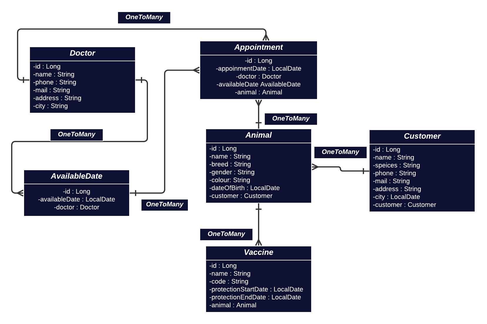

# VetApp v1

VetApp is a web application that assists veterinarians and veterinary clinics in managing customer, animal, appointment, and vaccine information.

## Technologies

This project has been developed using the following technologies:

- **Java**
- **Spring Boot**
- **Spring Data JPA**
- **ModelMapper**
- **Lombok**
- **Hibernate**
- **Maven**

## Project Structure

The project consists of the following packages and classes:

| Package/Class                     | Description                            |
|-----------------------------------|----------------------------------------|
| `api`                             | Contains Restful APIs.                 |
| `business.abstracts`              | Contains business service interfaces.  |
| `core.config.modelMapper`         | Contains ModelMapper configurations.   |
| `core.result`                     | Contains helper classes for creating API results. |
| `core.utilities`                  | Contains utility classes.              |
| `dto.request`                     | Contains data transfer objects for API requests. |
| `dto.response`                    | Contains data transfer objects for API responses. |
| `entities`                        | Contains entity classes for the database. |

## Endpoints

| Endpoint                           | Description                            |
|------------------------------------|----------------------------------------|
| POST /v1/appointments              | Adds a new appointment.                |
| PUT /v1/appointments               | Updates an existing appointment.       |
| GET /v1/appointments/{id}         | Retrieves an appointment by the specified ID. |
| DELETE /v1/appointments/{id}      | Deletes an appointment by the specified ID. |
| GET /v1/appointments/appointments-date-doctor | Filters appointments by a specified date range and doctor. |
| GET /v1/appointments/appointments-date-animal | Filters appointments by a specified date range and animal. |
| POST /v1/available-dates           | Adds a new available date.            |
| PUT /v1/available-dates            | Updates an existing available date.   |
| GET /v1/available-dates/{id}      | Retrieves an available date by the specified ID. |
| DELETE /v1/available-dates/{id}   | Deletes an available date by the specified ID. |
| POST /v1/customers                 | Adds a new customer.                  |
| GET /v1/customers/{id}            | Retrieves a customer by the specified ID. |
| PUT /v1/customers                  | Updates an existing customer.          |
| DELETE /v1/customers/{id}         | Deletes a customer by the specified ID. |
| GET /v1/customers                  | Retrieves customers by their names.    |
| GET /v1/customers/by-animal-list/{id} | Retrieves customers by a specified animal. |
| POST /v1/doctors                   | Adds a new doctor.                    |
| GET /v1/doctors/{id}              | Retrieves a doctor by the specified ID. |
| PUT /v1/doctors                    | Updates an existing doctor.           |
| DELETE /v1/doctors/{id}           | Deletes a doctor by the specified ID. |
| POST /v1/vaccines                  | Adds a new vaccine.                   |
| PUT /v1/vaccines                   | Updates an existing vaccine.          |
| GET /v1/vaccines/{id}             | Retrieves a vaccine by the specified ID. |
| DELETE /v1/vaccines/{id}          | Deletes a vaccine by the specified ID. |
| GET /v1/vaccines/animal/{id}      | Retrieves vaccines by a specified animal. |
| GET /v1/vaccines/end-date          | Filters vaccines by a specified end date. |

## UML

## Installation and Usage

Clone the project to your local machine. Then, open the project in a Java IDE (such as IntelliJ IDEA or Eclipse) and install Maven dependencies. Start the project and use a REST client to test the APIs.

