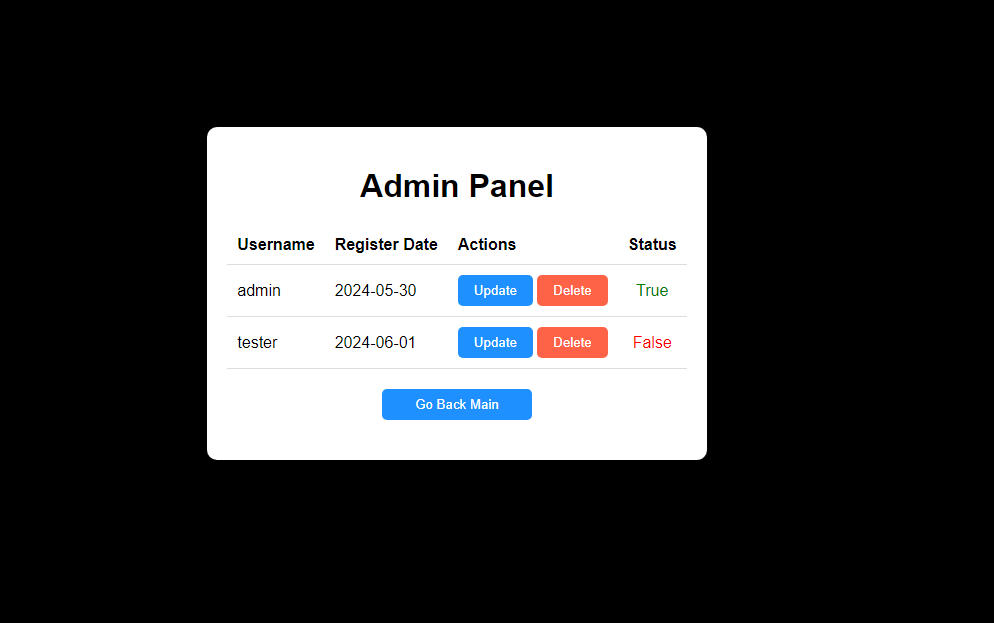

# Veterinary Management API

## Overview
This project is a Veterinary Management API designed to manage various aspects of a veterinary practice, including appointments, doctors, customers, and animal records. The project is implemented in Java and follows a RESTful architecture.

## Project Structure
The project is organized into several packages, each serving a different purpose. Here is an overview of the key packages and their functionalities:

- **Core Configuration**
    - Security: Contains security configurations.
    - Web Config: Configurations for the web layer.
    - Model Mapper: Configurations for model mapping.

- **Exceptions**
    - Defines custom exceptions for various error scenarios such as:
        - AppointmentAlreadyExists
        - NotFoundAnimalException
        - And others.

- **Controllers**
    - Handles incoming HTTP requests and maps them to appropriate service methods. Key controllers include:
        - CustomerController
        - DoctorController
        - AppointmentController
        - And others.

- **Services**
    - Contains business logic and service methods. Key services include:
        - CustomerService
        - DoctorService
        - AppointmentService
        - And others.

- **Models**
    - Defines the data models for the application. Key models include:
        - Customer
        - Doctor
        - Appointment
        - And others.

- **Repositories**
    - Interfaces for CRUD operations on data models. Key repositories include:
        - CustomerRepository
        - DoctorRepository
        - AppointmentRepository
        - And others.

- **Configurations**
    - Contains configuration classes for various aspects of the application. Key configurations include:
        - SecurityConfig
        - WebConfigurer
        - ModelMapperConfig
        - And others.

## How to Run
1. Clone the repository.
2. Navigate to the project directory.
3. Build the project using Maven:
   ```bash
   mvn clean install
   ```
4. Run the application:
   ```bash
   mvn spring-boot:run
   ```

## Dependencies
- Spring Boot
- Spring Security
- Spring MVC
- Spring Data JPA
- Validation
- Lombok
- ModelMapper
- Hibernate
- JPA

## Endpoints
Here is a list of key endpoints provided by the API:

- **Customer**
    - `GET /customers`: Get all customers.
    - `POST /customers`: Create a new customer.
    - `GET /customers/{id}`: Get customer by ID.

- **Doctor**
    - `GET /doctors`: Get all doctors.
    - `POST /doctors`: Create a new doctor.
    - `GET /doctors/{id}`: Get doctor by ID.

- **Appointments**
    - `GET /appointments`: Get all appointments.
    - `POST /appointments`: Create a new appointment.
    - `GET /appointments/{id}`: Get appointment by ID.

- **Animals**
    - `GET /animals`: Get all animals.
    - `POST /animals`: Create a new animal record.
    - `GET /animals/{id}`: Get animal by ID.

## Error Handling
The application uses a global exception handler to manage errors and provide meaningful responses to the client.

## Interface

In this project, MVC (Model-View-Controller) architecture is used. The interface components are located under a "resources" folder, which contains HTML, CSS, and JavaScript files. According to the MVC architecture:

- **Model:** Data models and business logic reside here.
- **View:** User interface components are found here. These components include HTML files and associated CSS and JavaScript files.
- **Controller:** Controllers are used to handle incoming requests and manage interaction between the model and view.

To access the interface components of the project, you can follow these steps:

1. Navigate to the "resources" folder in the project directory.
2. Inside this folder, you will find model, view, and controller components according to the MVC structure.
3. You can start using the interface by opening the relevant HTML, CSS, and JavaScript files in a web browser.

If you have any questions or feedback regarding the interface of the project, please feel free to contact us.

**DEMO IMAGES:**

**Login**


**Register**


**Main**


**Panel**


**Create**


**Update-Delete**


## License
This project is licensed under the MIT License.
